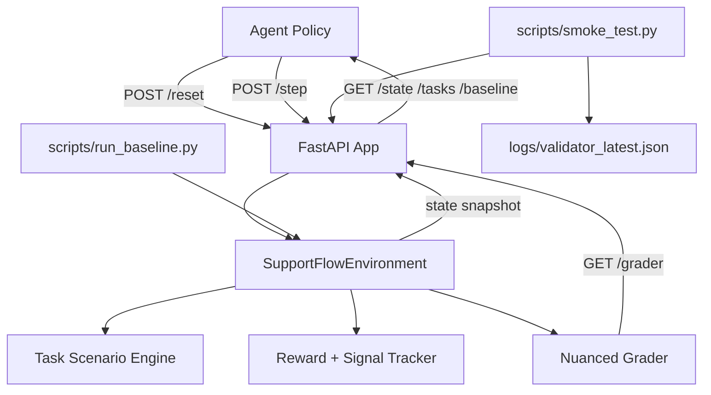

# SupportFlow AI (OpenEnv Round 1 Project)

SupportFlow AI is a real-world customer support resolution environment for OpenEnv.
An AI agent must classify issues, respond appropriately, and resolve tickets using the standard API.

## Why this environment

- Realistic domain: customer support workflows used in SaaS and e-commerce teams.
- Incremental difficulty with edge cases: easy -> medium -> hard tasks.
- Nuanced grader: combines classification, follow-up behavior, resolution quality, empathy, safety, policy compliance, and efficiency.
- Reward shaping includes partial progress, quality bonuses, and negative penalties for unsafe tone or premature closure.

## Demo

Short walkthrough GIF (replace with your own recorded run before final submission):


## Architecture



## Tasks

1. `easy_billing_duplicate_charge` (easy)
- Edge case: duplicate monthly charge complaint with refund expectation.

2. `easy_refund_window_policy` (easy)
- Edge case: refund requested outside standard window, requiring policy explanation.

3. `medium_technical_login_loop` (medium)
- Edge case: repeated token expiration after password reset.

4. `medium_billing_invoice_mismatch` (medium)
- Edge case: invoice total mismatch due to tax interpretation.

5. `hard_refund_damaged_multistep` (hard)
- Multi-step: gather proof, provide resolution, close in proper sequence.

6. `hard_technical_outage_escalation` (hard)
- Multi-step: gather incident details, provide mitigation, escalate and close safely.

All graders return scores in `[0.0, 1.0]`.

## Action Space

`POST /step` body:

```json
{
  "classify_issue": "billing | technical | refund | null",
  "message": "string",
  "ask_followup": false,
  "propose_resolution": false,
  "close_ticket": false
}
```

## Observation Space

`/reset` and `/step` responses include:

- `task_id`
- `difficulty`
- `customer_message`
- `ticket_history`
- `available_actions`

## API Endpoints

Required OpenEnv endpoints:

- `POST /reset`
- `POST /step`
- `GET /state`

Additional required endpoints:

- `GET /tasks`
- `GET /grader`
- `GET /baseline`
- `POST /baseline`

Utility endpoint:

- `GET /health`

## Local setup

```bash
python -m venv .venv
.venv\Scripts\activate
pip install -r requirements.txt
uvicorn app.main:app --host 0.0.0.0 --port 7860
```

Test quickly:

```bash
curl http://localhost:7860/health
curl -X POST http://localhost:7860/reset -H "Content-Type: application/json" -d "{}"
curl http://localhost:7860/tasks
curl http://localhost:7860/baseline
```

## Baseline inference

Deterministic baseline script with positive and negative episode analysis:

```bash
python scripts/run_baseline.py
```

Output includes:

```json
{
  "average_score": 0.95,
  "failure_case_average": 0.2,
  "robustness_margin": 0.75,
  "results": [
    {
      "task_id": "easy_billing_duplicate_charge",
      "score": 0.96,
      "steps": 1,
      "breakdown": {
        "classification": 1.0,
        "resolution": 1.0,
        "response_quality": 0.84
      },
      "failure_case_score": 0.04,
      "failure_case_reason": "Intentional negative run ..."
    }
  ]
}
```

Exact scores may vary as grader logic evolves.

## Submission inference script

The required evaluator entrypoint is [inference.py](inference.py) at the repository root.

Before running it, set:

- `API_BASE_URL`
- `MODEL_NAME`
- `HF_TOKEN`

Run:

```bash
python inference.py
```

The script prints strict structured lines only:

- `[START] task=<task_name> env=<benchmark> model=<model_name>`
- `[STEP] step=<n> action=<action_str> reward=<0.00> done=<true|false> error=<msg|null>`
- `[END] success=<true|false> steps=<n> rewards=<r1,r2,...,rn>`

## Docker

Build and run:

```bash
docker build -t supportflow-ai .
docker run -p 7860:7860 supportflow-ai
```

Run smoke tests against local server:

```bash
python scripts/smoke_test.py
```

Smoke test now validates extra negative scenarios and writes validator logs:

- `logs/validator_latest.json`
- `logs/validator_<timestamp>.json`

Validated negative cases include:

- invalid task id rejection (`HTTP 400`)
- `step` before `reset` rejection (`HTTP 400`)
- episode-closed behavior (`reward=0`, `done=true`)
- premature close penalty (negative reward)

## Hugging Face Spaces deployment

Use Docker Space and include this repository files as-is:

- `Dockerfile`
- `requirements.txt`
- `app/`
- `app.py`
- `openenv.yaml`

Set Space to expose port `7860`.

Suggested deployment flow:

```bash
huggingface-cli login
git remote add hf https://huggingface.co/spaces/<your-username>/supportflow-ai
git push hf master
```

Then verify:

- Space URL returns `200`
- `POST /reset` responds with a valid observation
- `GET /baseline` returns scores for all 6 tasks

For submission evidence, attach or paste `logs/validator_latest.json` output.

## File map

- `app/environment.py`: task definitions, reward logic, grader, state machine.
- `app/models.py`: typed request/response models.
- `app/main.py`: FastAPI endpoints.
- `app/baseline.py`: reproducible baseline policy.
- `scripts/run_baseline.py`: CLI script for baseline scoring.
- `scripts/smoke_test.py`: endpoint validation with negative tests + validator log export.
- `openenv.yaml`: OpenEnv metadata and endpoint/model declarations.
